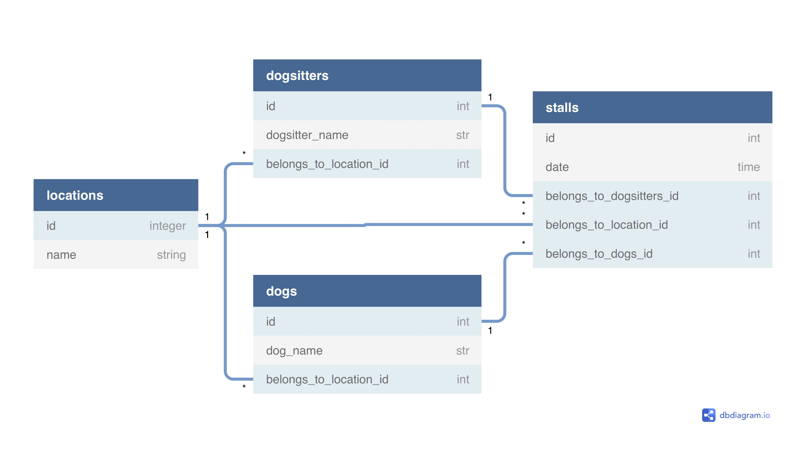

# README

Creation des models: 

	Dogsitter, Dog, Stoll & Location

Avec les relations:

	Un dogsitter peut promener plusieurs dog lors d'une stroll (promenade, en anglais) ; et un dog peut avoir plusieurs dogsitter via les stroll.
	Chaque ville contient plusieurs promeneurs et plusieurs chiens mais un chien et un promeneur ne peuvent appartenir qu'a une ville.

Creation d'un seeds.rb